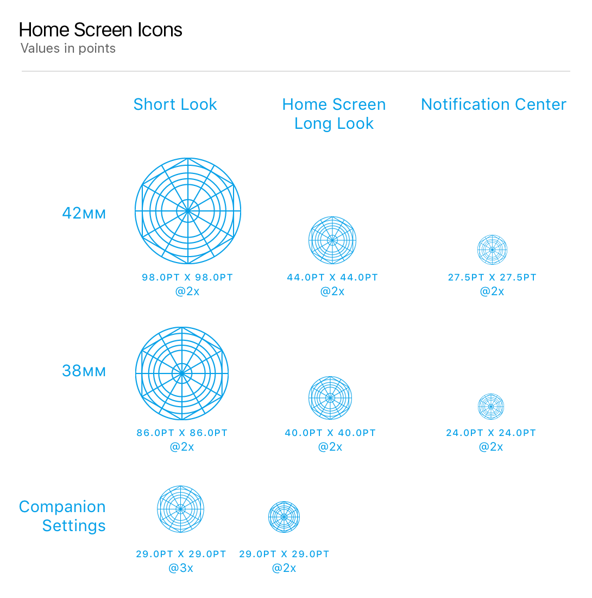

# Watch-Icon

Plugin for Bohemian Coding Sketch app that automatically resizes artwork for Apple Watch icon.

This project is based on [AEIconizer](https://github.com/tadija/AEIconizer) in ***Apple Watch*** icon size version.

## Installation

1. [Download the ZIP file of this repository](https://github.com/MaxChen/Watch-Icon/archive/master.zip)
2. Double click on `Watch Icon.sketchplugin`

## Icon sizes
Here are the icon sizes for Watch apps. All values are in pixels and listed as the width followed by the height.

| Icon Assets  	   | 38mm | 42mm |
|:------------|:----------|:--------|
| **Notification Center icon**    | 48px   | 55px |
| **Long-Look notification icon**    | 80px    | 88px |
| **Home Screen icon**    | 80px    | 80px |
| **Short-Look icon**    | 172px    | 196px |

Here are the icon sizes for your app when it is displayed by Apple’s Watch app on iPhone

| Icon Assets  	   | 2x | 3x |
|:------------|:----------|:--------|
| **App icon**    | 58px    | 87px |

